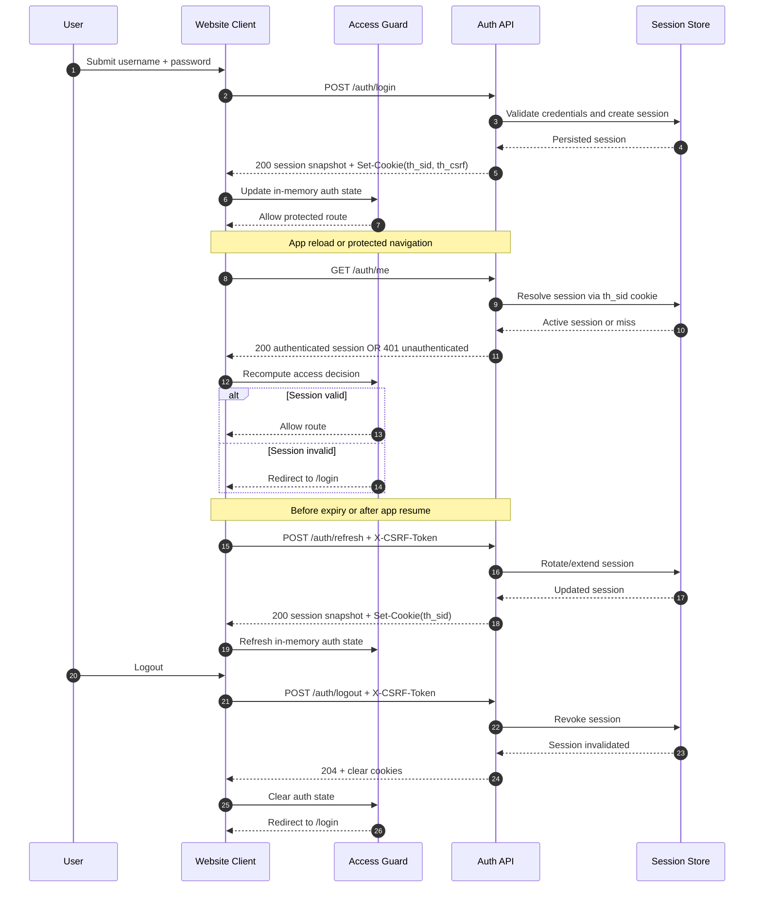

# Website Auth Sequence Diagram

Date: 2026-03-10
Status: Draft

## Login -> Session -> Guard

## Guard-Regeln

- Protected routes trusten nur `GET /auth/me` bzw. den zuletzt serverseitig bestaetigten Snapshot.
- `401` fuehrt immer zu fail-closed.
- Rollenpruefung bleibt im Access-Control-Layer, nicht im HTTP-Adapter.
