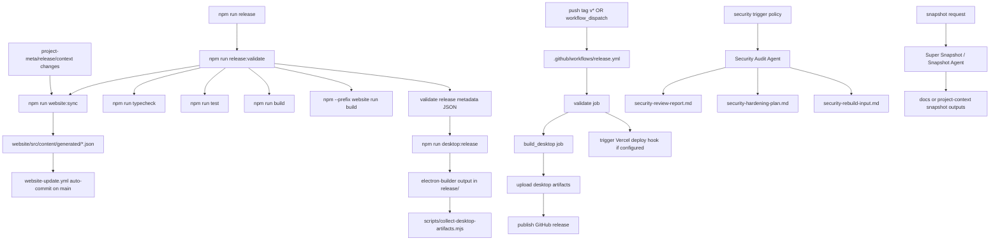

File: docs/WORKFLOW_GRAPH.md  
Location: /docs/WORKFLOW_GRAPH.md  
Generated by: Super Snapshot Agent  
Generated at: 2026-03-11T01:19:24+01:00

# Workflow Graph

## Workflow Inventory
- Release validation and release build (`scripts/release-orchestrator.ts`, `scripts/run-release.ts`)
- Website content generation (`scripts/generate-website-content.ts`)
- Website status export (`scripts/export-website-status.mjs`)
- Feature change watcher (`scripts/feature-change-watcher.ts`)
- CI release pipeline (`.github/workflows/release.yml`)
- CI website sync pipeline (`.github/workflows/website-update.yml`)
- Security audit reporting workflow (`project-context/security-reports/*`)
- Snapshot generation workflow (`agents/10-super-snapshot-agent.md`, `agents/optional/10-snapshot.md`)

## End-to-End Graph (Mermaid)

## Trigger Rules Summary
- Release local trigger: `npm run release`
- Release CI trigger: Git tag `v*` or manual dispatch
- Website sync CI trigger: `main` changes in `project-meta/**`, `releases/**`, sync script, or generated website content paths
- Feature watcher trigger: filesystem changes in `project-meta`, `releases`, `docs/public`
- Security trigger (policy): before release, after major refactor, auth/authz change, deployment/infra change, integration change, auto-update change
- Snapshot trigger: user asks for snapshot/context export/update

## Interactions and Dependencies
- Release validation consumes content-sync output first, so metadata quality directly affects release output.
- CI release and CI website-sync can both write generated files, making branch state sensitive to generation consistency.
- Security and snapshot processes are policy-coupled via agent instructions, not strict CI blocking jobs.
- Website pipeline relies on `project-meta` and `releases` JSON completeness; empty source files produce low-value generated outputs.

## Current Workflow State
- `npm run test`: passing.
- `npm run typecheck`: failing.
- `npm run build` (root): failing on Node API usage in browser path.
- `npm --prefix website run build`: passing.
- Release workflow design is complete, but effective release readiness is blocked by failing root quality gates.
